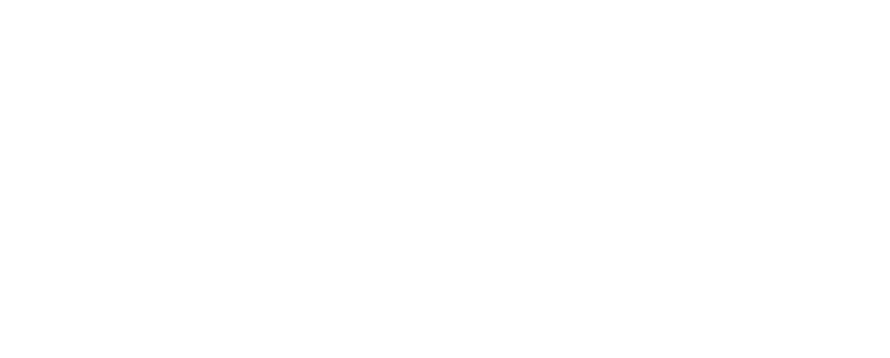
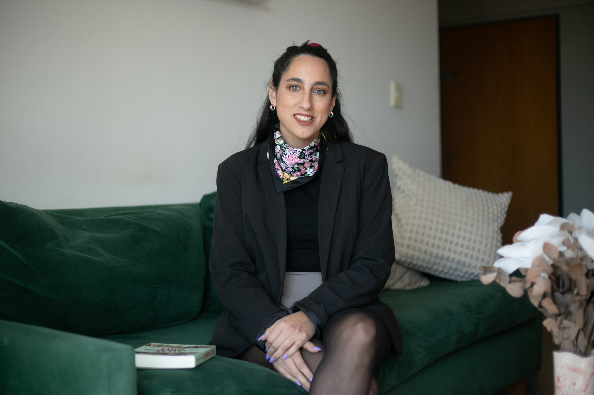

::: {.hero-splash #inicio}

  

:::

::: {.hero #presentacion}

::: {.hero-grid}

::: {.hero-copy}

Diversidad, equidad e inclusión  

# Culturas laborales equitativas, sostenibles y con impacto real

Sinergia acompaña a empresas, organizaciones e instituciones en procesos de transformación que reconocen la diversidad como un valor estratégico. La propuesta combina una mirada interdisciplinaria e interseccional con herramientas concretas para construir entornos de trabajo más seguros, respetuosos e inclusivos.

[Ver servicios](#servicios){.btn-brand}  
[Conocer al equipo](#equipo){.btn-ghost}

:::

::: {.hero-panel}

### Nuestra propuesta

Planificación con propósito e inclusión con sostenibilidad: diseñamos acciones a medida y alineadas con los estándares de Diversidad, Equidad e Inclusión.

::: {.mini-pillars}
Diagnóstico  
Capacitación  
Políticas DEI  
Responsabilidad social
:::

:::

:::
:::

::: {.section .section-soft}

::: {.section-wrap}

::: {.section-heading #nosotras}

::: {.section-kicker}
NOSOTRAS
:::

## Una consultora que articula misión, visión y acción

:::

::: {.grid-2}

::: {.card-soft}

### Nuestra misión

Acompañamos a organizaciones en la construcción de entornos laborales más justos, equitativos y sostenibles. Abordamos problemáticas como el mal clima laboral, la discriminación y los sesgos inconscientes. Trabajamos en la incorporación de políticas inclusivas y promovemos acciones de responsabilidad social con impacto real.

:::

::: {.card-soft}

### Nuestra visión

Trabajamos con una perspectiva interseccional y situada, reconociendo la complejidad de las trayectorias laborales y personales. Desde un enfoque profesional e interdisciplinario, promovemos culturas organizacionales sensibles a las dinámicas sociales, económicas y culturales, alineadas con estándares de diversidad, equidad e inclusión.

:::

  

:::

::: {.values-grid}

::: {.value-card .orange}
### Inclusión

Diseño de procesos y espacios que amplían la participación, revisan barreras y fortalecen la convivencia institucional.
:::

::: {.value-card .pink}
### Sostenibilidad

Transformaciones que pueden sostenerse en el tiempo mediante políticas, protocolos, formación y acompañamiento.
:::

::: {.value-card .blue}
### Propósito

Planificación estratégica con impacto social concreto, conectando cultura organizacional, derechos y responsabilidad institucional.
:::

:::

:::

  

:::

::: {.section .section-warm}

::: {.section-wrap}

::: {.section-heading #servicios}

::: {.section-kicker}
QUE OFRECEMOS
:::

## Servicios adaptables a cada nivel organizacional

:::

::: {.services-grid}

::: {.service-card .pink}

### Diagnósticos situados e informes técnicos

Evaluamos el grado de diversidad, equidad e inclusión en cada organización a través de diagnósticos personalizados, investigaciones e informes con enfoque interseccional.
:::

::: {.service-card .orange}

### Formación, capacitación y sensibilización

Diseñamos espacios formativos adaptados a cada nivel organizacional para promover culturas laborales más inclusivas y conscientes.
:::

::: {.service-card .blue}

### Abordaje integral de situaciones de violencia y/o discriminación

Acompañamos la prevención, detección y atención de estas problemáticas mediante protocolos, asesoramiento y espacios confidenciales de escucha.
:::

::: {.service-card .purple}

### Asesoramiento e implementación de políticas DEI

Apoyamos a las organizaciones en el diseño e implementación de políticas inclusivas y sostenibles, con enfoque de derechos y equidad.
:::

::: {.service-card .pink}

### Diseño y gestión de proyectos de responsabilidad social

Desarrollamos iniciativas de responsabilidad social con impacto real, fortaleciendo el vínculo entre organizaciones y comunidades.
:::

:::

:::

  

:::

::: {.section .section-cool}

::: {.section-wrap}

::: {.section-heading #equipo}
::: {.section-kicker}
QUIENES SOMOS
:::

## Equipo SINERGIA

Articulamos trayectoria académica con recorrido institucional e intervenciones territoriales.

[Encontranos también en LinkedIn.](https://www.linkedin.com/in/sinergia-consultora-3239903b3/){.btn-brand}  

:::

::: {.team-grid}

::: {.team-card}

### Mariana  
**Psicología, formación y políticas de inclusión**

Psicóloga (UBA) y Magíster en Estudios y Políticas de Género (UNTREF). Docente universitaria. Acompaña a personas en contextos laborales críticos y coordina acciones de formación y sensibilización en organizaciones, universidades e instituciones públicas. Se especializa en derechos sexuales, violencia de género y políticas de inclusión.

[LinkedIn](https://www.linkedin.com/in/mariana-rosende-394b33179/){.btn-ghost}  

:::

::: {.team-card}

### Yanina
**Investigación, gestión institucional e impacto social**

Trabajadora Social (UBA), Magíster en Estudios y Políticas de Género (UNTREF) y Doctora en Antropología (UBA). Especialista en investigación con enfoque interseccional, docente universitaria y consultora independiente en género, diversidad y discriminación. Cuenta con experiencia en gestión institucional e implementación de proyectos de impacto social.

[LinkedIn](https://www.linkedin.com/in/yanina-kaplan-7a1730215/){.btn-ghost}  

:::

:::

:::

  

:::

::: {.section .section-lilac #contacto}

::: {.section-wrap}

::: {.section-heading}

## Conversemos

Si querés recibir una propuesta, coordinar una reunión o hacer una consulta, dejanos tus datos y te contactamos.

:::

<form action="https://formspree.io/f/xnjovder" method="POST" class="contact-form">
  <label for="nombre">Nombre</label>
  <input type="text" id="nombre" name="nombre" placeholder="Tu nombre" required>

  <label for="organizacion">Organización</label>
  <input type="text" id="organizacion" name="organizacion" placeholder="Nombre de la organización">

  <label for="email">Email</label>
  <input type="email" id="email" name="email" placeholder="tuemail@ejemplo.com" required>

  <label for="mensaje">Mensaje</label>
  <textarea id="mensaje" name="mensaje" rows="6" placeholder="Contanos brevemente qué necesitás" required></textarea>

  <button type="submit" class="btn-brand">Enviar consulta</button>
</form>

<a href="https://wa.me/5491131749053?text=Hola%20Sinergia%2C%20vi%20su%20p%C3%A1gina%20web%20y%20me%20gustar%C3%ADa%20hacer%20una%20consulta.%20Mi%20nombre%20es%0A"
  class="whatsapp-float" 
  target="_blank" 
  aria-label="Contactar por WhatsApp">
  📞
</a>

:::
:::